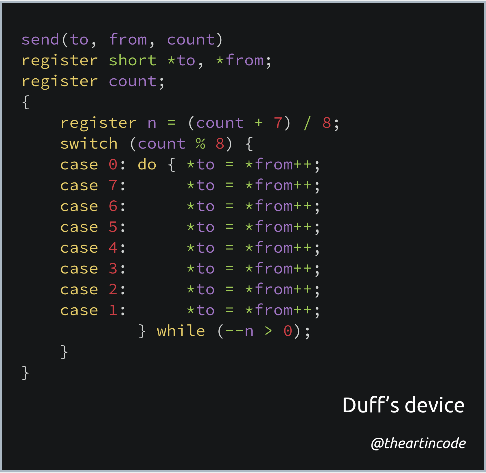

# 001 - Duff's device

<picture>
  <source srcset="img/code.webp" type="image/webp">
  <source srcset="img/code.png" type="image/png">
  
</picture>

[*Snippet source*](https://www.lysator.liu.se/c/duffs-device.html)

[*Wikipedia article*](https://en.wikipedia.org/wiki/Duff%27s_device)

Duff's device is a famous snippet of C code that manually performs [loop unrolling](https://www.geeksforgeeks.org/loop-unrolling/).

Manually unrolling loops is nowadays considered a bad practice, as most
compilers perform this automatically behind the scenes.

However, the historical significance of Duff's device remains: it reminds us
that creativity can help us overcome limits introduced by abstraction created
in a higher level language (in this case C as opposed to assembly).

## Explanation

At least two good explanations are available that break this code down in detail:

-   [Stack Overflow - How does Duff's device work?](https://stackoverflow.com/questions/514118/how-does-duffs-device-work)
-   [GeeksforGeeks - How does Duff’s Device work?](https://www.geeksforgeeks.org/duffs-device-work/)
