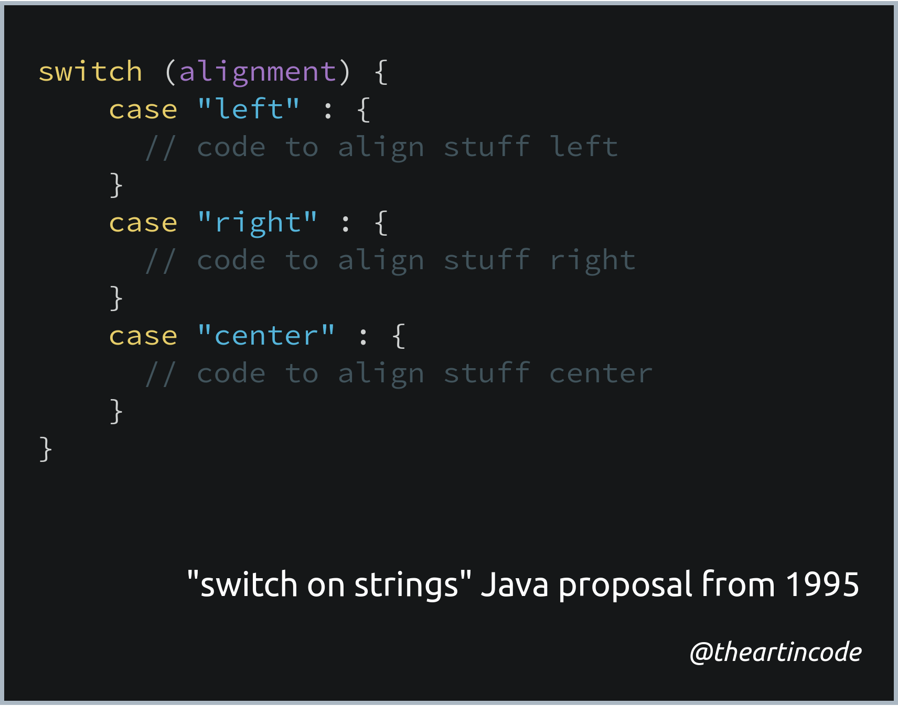

# 002 - switch on strings

<picture>
  <source srcset="img/code.webp" type="image/webp">
  <source srcset="img/code.png" type="image/png">
  
</picture>

[*Snippet source*](https://bugs.java.com/bugdatabase/view_bug.do?bug_id=1223179)

While [switch statements](https://en.wikipedia.org/wiki/Switch_statement) exist
in practically all major high-level languages, many languages restrict the types
that can be used inside them. This is usually for performance reasons.

Most notably, Java initially didn't allow switch on strings. In 1995, [a feature request](https://bugs.java.com/bugdatabase/view_bug.do?bug_id=1223179)
was opened in 1995 asking the language developers to add support. The reply at
the time was simply:

> Don't hold your breath.

> Nothing resembling this is in our plans.

Java introduced support for "switch on strings" 16 years after the original
request was made, in version 7, making this one of the longest-open feature
requests in the language.

## Significance

The switch on strings is a good example of a language feature that we take for
granted. In reality, it's a special case that requires a lot of engineering
behind the scenes.

Many high-level languages today still have limited support for strings in
switch statements and string handling in general.

## More information

An official explanation for this delay was never provided.

As mentioned above, type restrictions inside switch statements are usually done
for performance reasons. Many programming languages that support switch
statements rely on a technique called [lookup tables](https://en.wikipedia.org/wiki/Lookup_table)
which is difficult to apply on strings.

You can read more about how Java handles switches, including switches on
strings, [in this StackOverflow answer](https://stackoverflow.com/a/338230/2676845).
