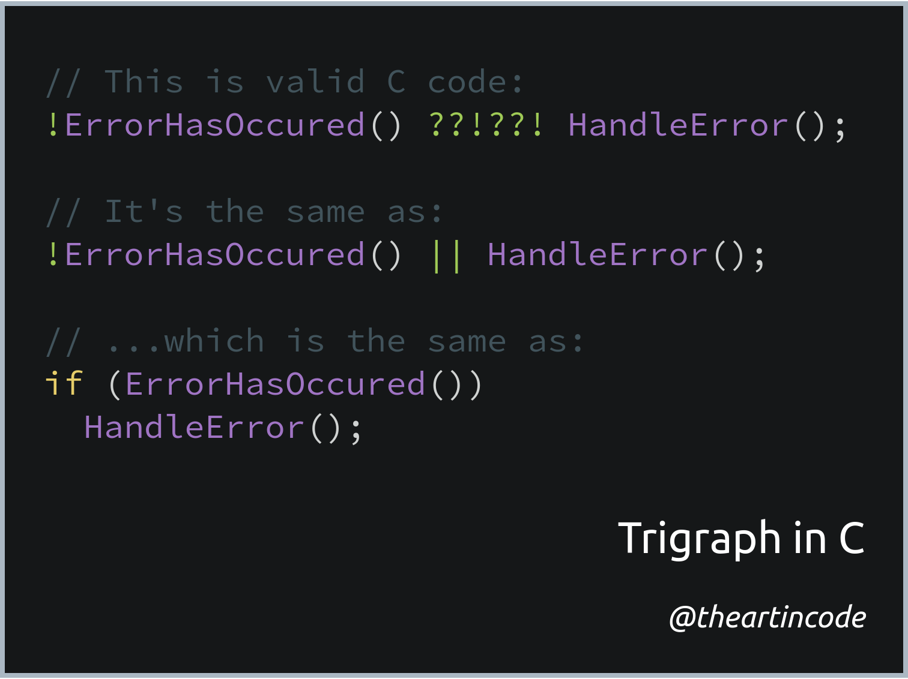

# 003 - Trigraph

<picture>
  <source srcset="img/code.webp" type="image/webp">
  <source srcset="img/code.png" type="image/png">
  
</picture>

[*Snippet source*](https://stackoverflow.com/questions/7825055/what-does-the-c-operator-do)

The code snippet above performs [short-circuit evaluation](https://en.wikipedia.org/wiki/Short-circuit_evaluation):
`HandleError()` will only happen if `!ErrorHasOccured()` evaluates to `TRUE`.
However, instead of `||`, which is normally used for this, the snippet above
uses `??!??!` which most C compilers still allow.

## Explanation

Similar to spoken languages, some programming languages support
[digraphs and trigraphs](https://en.wikipedia.org/wiki/Digraphs_and_trigraphs#C) - groups
of two or three characters used to symbolise one character.

Before the current QWERTY keyboard layout was widespread, some keyboards didn't
have special characters such as `|`. To make things easier for programmers,
the C preprocessor made is so that typing `??!` is the same as typing `|`.
Similar rules exist for other characters which were less common on keyboards at
the time, such as `#`, `~` and `^`.

While largely irrelevant nowadays, many C compilers still support this. This
makes it possible to replace `||` with `??!??!` anywhere in your C code.

Needless to say, using `??!??!` instead of `||` in code is both unnecessary and
something that few are familiar with, making this a bad practice for production
code.
