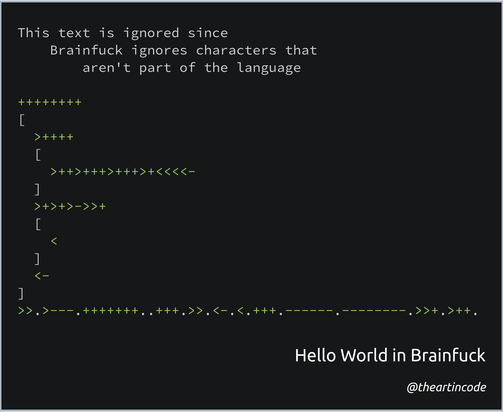

# 004 - Hello World in Brainfuck

<picture>
  <source srcset="img/code.webp" type="image/webp">
  <source srcset="img/code.png" type="image/png">
  
</picture>

[*Snippet source*](https://en.wikipedia.org/wiki/Brainfuck)

It doesn't look like source code at first, but this snippet is actually valid
code written in a language called Brainfuck.

Brainfuck supports only 8 commands, each represented with a single character.
These valid commands are: `><+-.,[]`. Everything else is ignored.

Brainfuck is considered an *esoteric programming language* meaning it has no
practical purpose and is made for exploratory and research purposes, as a proof
of concept or just for fun.

## Try it out

You can run the snippet above [by following this link](https://copy.sh/brainfuck/?c=VGhpcyB0ZXh0IGlzIGlnbm9yZWQgc2luY2UKICAgIEJyYWluZnVjayBpZ25vcmVzIGNoYXJhY3RlcnMgdGhhdAogICAgICAgIGFyZW4ndCBwYXJ0IG9mIHRoZSBsYW5ndWFnZQoKKysrKysrKysKWwogID4rKysrCiAgWwogICAgPisrPisrKz4rKys-Kzw8PDwtCiAgXQogID4rPis-LT4-KwogIFsKICAgIDwKICBdCiAgPC0KXQo-Pi4-LS0tLisrKysrKysuLisrKy4-Pi48LS48LisrKy4tLS0tLS0uLS0tLS0tLS0uPj4rLj4rKy4K).

## Explanation

Brainfuck operates on top of a single "data" array and it can only manipulate a
single element at a time, either changing its value or printing it out. `>` and
`<` are used to move on to the next or previous element respectively, making
Brainfuck function in a way that's similar to a [Turing machine](https://en.wikipedia.org/wiki/Turing_machine).

Wikipedia has an [in-depth explanation](https://en.wikipedia.org/wiki/Brainfuck#Hello_World!)
of the Hello World program above.
