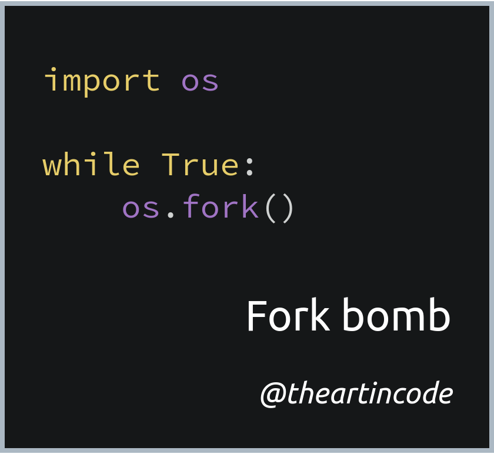

# 005 - Fork bomb

<picture>
  <source srcset="img/code.webp" type="image/webp">
  <source srcset="img/code.png" type="image/png">
  
</picture>

[*Snippet source*](https://en.wikipedia.org/wiki/Fork_bomb)

A *fork bomb* is a type of attack where a process makes copies of itself until
the system runs out of resources.

The code above shows this type of attack implemented in Python in just 3 lines
of code. An infinite loop calls [`fork()`](https://en.wikipedia.org/wiki/Fork_(system_call)),
a system call that causes the process to make a copy of itself. The newly
created process then proceeds to do the same thing once it starts.

**Note:** Running this code will almost certainly cause your system to hang and
you may be forced to reboot.

Due to its malicious nature, the fork bomb can be considered to be one of the
simplest possible [computer viruses](https://en.wikipedia.org/wiki/Computer_virus).
