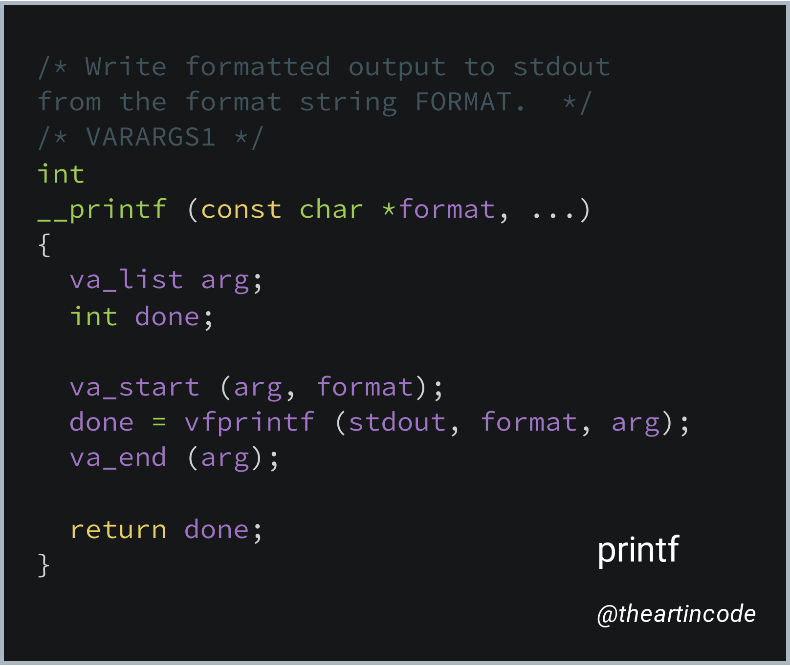

# 006 - printf

<picture>
  <source srcset="img/code.webp" type="image/webp">
  <source srcset="img/code.png" type="image/png">
  
</picture>

[*Snippet source*](https://github.com/lattera/glibc/blob/895ef79e04a953cac1493863bcae29ad85657ee1/stdio-common/printf.c#L24-L37)

"printf" is the name of one of the most well known and most used functions in
the C programming language.

It stands for "**print f**ormatted" and it's used to display output on the
screen in a formatted way, by using a simple structured template language.

Equivalent or similar functions exist in many other programming languages.

## Example use

For example, to display two numbers with a dash in between, `printf` could be
used this way:

```c
printf("%d-%d", first_number, second_number);
```

In this example, `%d` is the template used to indicate a number (the "d" stands
for "decimal"). `printf` replaces this with the number provided in the
arguments.

## Importance

Because displaying text on screen is a very easy way to see the effect of
running a program, `printf` is often the first function introduced when learning
how to code.

The function name also became well known over the years and is sometimes used
to refer to the general idea of displaying things on the screen. For example,
the term "printf debugging" is used to denote using `printf` statements to track
the flow of execution when debugging code.

## Snippet explanation

The snippet above comes from [glibc](https://www.gnu.org/software/libc/) and
is just a trivial wrapper around [`vfprintf`](https://en.cppreference.com/w/c/io/vfprintf)
which implements the logic behind `printf`.

The wrapper exists because `printf` is a [variadic function](https://en.cppreference.com/w/c/variadic)
while the less-known `vfprintf` is not and also allows specifying the output
location, while `printf` sends the output to [stdout](https://en.wikipedia.org/wiki/stdout).
