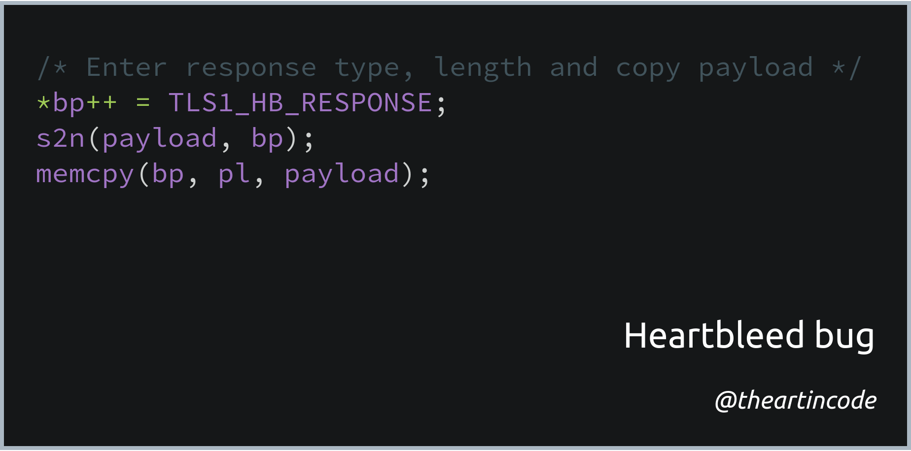

# 007 - Heartbleed bug

<picture>
  <source srcset="img/code.webp" type="image/webp">
  <source srcset="img/code.png" type="image/png">
  
</picture>

[*Snippet source*](https://www.seancassidy.me/diagnosis-of-the-openssl-heartbleed-bug.html)

"Heartbleed" is the name given to a bug in the popular OpenSSL cryptographic
software library that created a serious vulnerability which allowed attackers to
read memory from otherwise secure servers.

The bug was introduced into the software in 2012 and the vulnerability was
publicly disclosed in April 2014. According to [heartbleed.com](http://heartbleed.com/),
testing the vulnerability on their own services allowed stealing of certificate
keys, user names and passwords, instant messages, emails and business critical
documents and communication.

## "Heartbleed" explanation

The bug allowed the attacker to perform a [buffer over-read](https://en.wikipedia.org/wiki/Buffer_over-read),
a situation where more data can be read than should be allowed.

An visual explanation of this is provided in
<a href="https://www.xkcd.com/1354/" target="_blank">xkcd #1354</a>:

## Snippet explanation

The three lines of code above are the core of the bug: [`memcpy`](https://en.cppreference.com/w/cpp/string/byte/memcpy) is a function used to copy a given number of bytes from one
memory location to another.

The number of bytes given is specified in the variable `payload`, which is in
this case provided by the user. This allows the attacker to request any number
of bytes from the server, which is then copied and returned in the response.

## More information

For more information, see:

*   [Wikipedia page for Heartbleed](https://en.wikipedia.org/wiki/Heartbleed)
*   [heartbleed.com](http://heartbleed.com/)
*   [Diagnosis of the OpenSSL Heartbleed Bug](https://www.seancassidy.me/diagnosis-of-the-openssl-heartbleed-bug.html) by [Sean Cassidy](https://twitter.com/sean_a_cassidy)
*   [Heartbleed Bug Explained](https://stackabuse.com/heartbleed-bug-explained/) by [Scott Robinson](https://twitter.com/ScottWRobinson)
