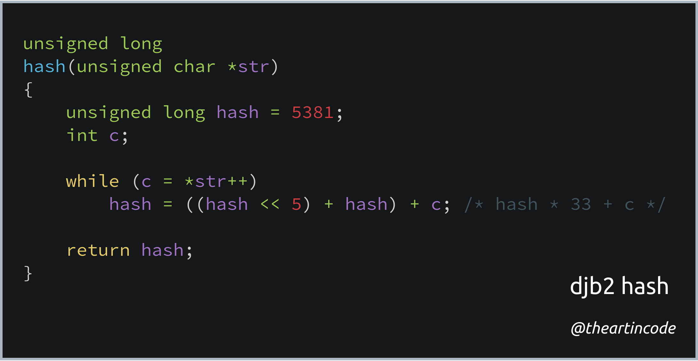

# 008 - djb2 hash

<picture>
  <source srcset="img/code.webp" type="image/webp">
  <source srcset="img/code.png" type="image/png">
  
</picture>

[*Snippet source*](http://www.cse.yorku.ca/~oz/hash.html)

Written by [Daniel J. Bernstein](https://en.wikipedia.org/wiki/Daniel_J._Bernstein)
(also known as **djb**), this simple hash function dates back to 1991.

[Hash functions](https://en.wikipedia.org/wiki/Hash_function) have wide
applications in computer science and in cryptography. They are used to map a
potentially large amount of data to a number that represents it.

For example, the hash function from this code snippet maps `Hello` to
`210676686969`, but `Hello!` to `6952330670010`. Despite the fact there's only
one character different (the exclamation mark), the number returned is
completely different.

## Snippet explanation

The simple C function starts with the `hash` variable set to the number **5381**.

It then iterates the given array of characters `str` and performs the following
operations for each character:

1.  Multiply the `hash` variable by **33**.

2.  Add the [ASCII](https://en.wikipedia.org/wiki/ASCII) value of the current
    character to it.

After iterating through the whole array, it returns the value held by `hash`.

Multiplying `hash` by **33** could be performed by doing `hash * 33`. However,
the function instead uses `(hash << 5) + hash` [bit shifts](https://en.wikipedia.org/wiki/Bitwise_operation#Bit_shifts)
which is on many CPUs a faster way to perform this operation. `hash << 5`
"shifts" the bits to the left by 5 spaces, multiplying the number by 32 (2^5)
and `+ hash` adds another value of `hash`, turning this into multiplying by 33.

## More information

The starting number **5381** was picked by djb simply because testing showed that
it results in [fewer collisions](https://en.wikipedia.org/wiki/Collision_%28computer_science%29)
and [better avalanching](https://en.wikipedia.org/wiki/Avalanche_effect).

Interestingly, the choice of **33** has never been adequately explained.

*   [Why are 5381 and 33 so important in the djb2 algorithm?](https://stackoverflow.com/questions/1579721/why-are-5381-and-33-so-important-in-the-djb2-algorithm)
*   [Reason for 5381 number in DJB hash function?](https://stackoverflow.com/questions/10696223/reason-for-5381-number-in-djb-hash-function)
*   [hash function for mac needed](https://groups.google.com/forum/#!topic/comp.lang.c/lSKWXiuNOAk)
    (original source of the function)
