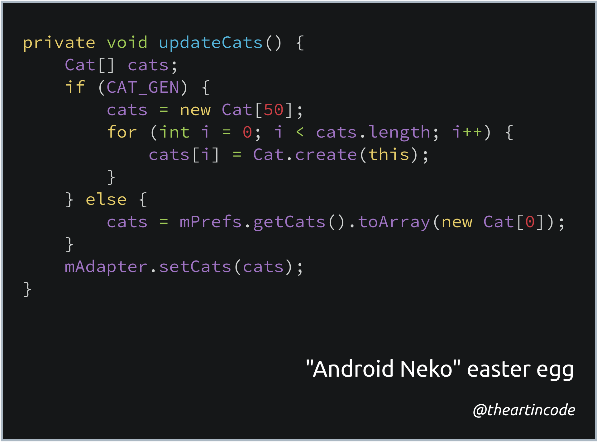

# 009 - "Android Neko" easter egg

<picture>
  <source srcset="img/code.webp" type="image/webp">
  <source srcset="img/code.png" type="image/png">
  
</picture>

[*Snippet source*](https://android.googlesource.com/platform/frameworks/base/+/android-7.0.0_r1/packages/EasterEgg/src/com/android/egg/neko/NekoLand.java)

"Easter eggs" are hidden features or messages, inside jokes, and cultural
references inserted into media. Easter eggs in software are often hidden
messages or even features that require following a series of undocumented steps
to trigger and discover.

[Neko Atsume: Kitty Collector](https://en.wikipedia.org/wiki/Neko_Atsume) is a
popular mobile game that revolves around the player purchasing food, cat toys
and furniture to attract a variety of cats to their home.

Android Nougat (version 7) included a game similar to Neko Atsume that allowed
the user to collect cats. The code snippet above belongs to the code of this
secret game.

## More information

*   [How to Play Google's Secret *Neko Atsume*-Style Easter Egg in Android Nougat](https://lifehacker.com/how-to-play-googles-secret-neko-atsume-style-easter-egg-1786123017)
*   [How to Enable Android Nougat’s Cat-Collecting Easter Egg](https://www.howtogeek.com/269207/how-to-enable-android-nougats-cat-collecting-easter-egg/)
